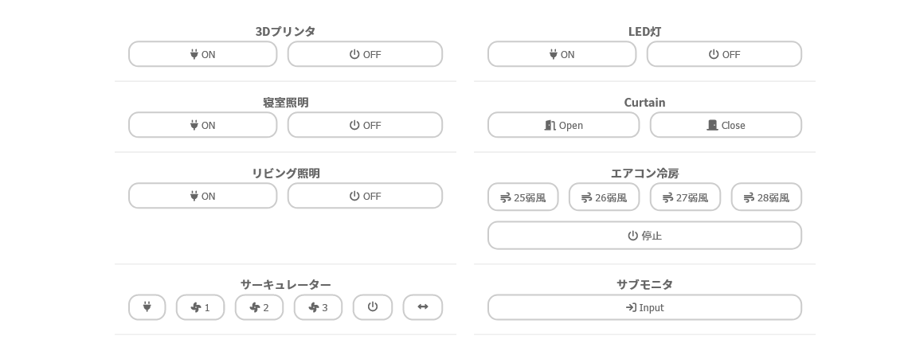

# switchweb - SwitchBot Client on local Web



## Environment variables

var                       | description
------------------------- | -----------
`SWITCHBOT_TOKEN`         | Open Token for SwitchBot API. See [this](https://github.com/OpenWonderLabs/SwitchBotAPI/blob/main/README.md#getting-started)
`SWITCHBOT_CLIENT_SECRET` | Open Token for SwitchBot API. See [this](https://github.com/OpenWonderLabs/SwitchBotAPI/blob/main/README.md#getting-started)
`ADDR`                    | Address and port to listen (Default: ':8080')
`CUSTOM_DEVICES`          | Definition of custom buttons

### Format of CUSTOM\_DEVICES

```json
[
  {
    "id": "01-202301234567-01234567",
    "buttons": [
      {
        "name": "NAME1",
        "icon": "wind"
      },
      {
        "name": "NAME2",
        "icon": "power-off"
      }
    ]
  }
]
```

key                  | value
-------------------- | -----
`.[].id`             | Device ID
`.[].buttons[].name` | Registerd button name
`.[].buttons[].icon` | Fontawesome icon name
